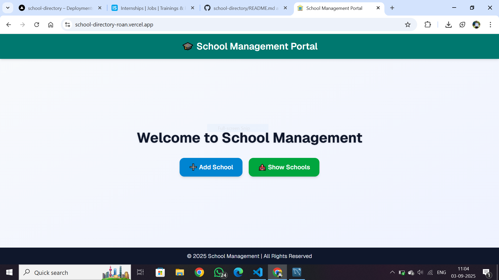
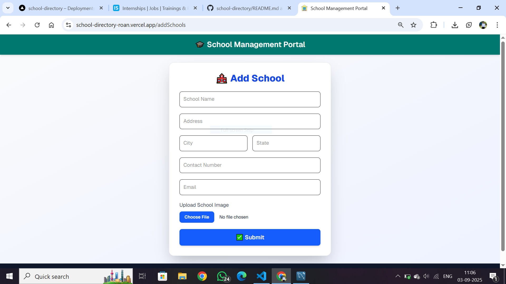
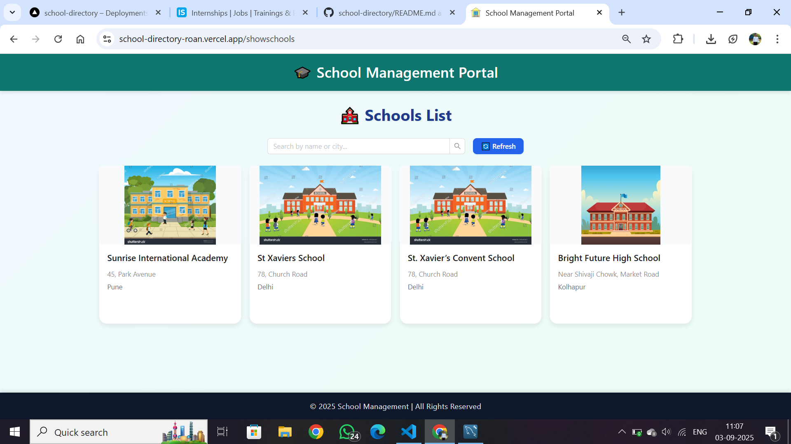

📘 School Management Portal
📌 Project Overview

The School Management Portal is a simple web application built with Next.js that allows users to manage school records efficiently.
Users can add new schools and view existing schools in a clean and responsive interface.

🚀 Features

🎓 Add Schools – Add school details (name, address, contact info, etc.).

🏫 Show Schools – View the list of schools in a structured card layout.

📱 Responsive UI – Works smoothly on desktop and mobile devices.

☁️ Image Upload Support (via Cloudinary).

🌐 Database Integration (MySQL hosted on Aiven).

🛠️ Tech Stack

Frontend: Next.js, React, Tailwind CSS

Backend: Node.js (API Routes)

Database: MySQL (Aiven Cloud)

Storage: Cloudinary (for images)

Deployment: Vercel

⚙️ Installation & Setup
1️⃣ Clone the Repository
git clone https://github.com/your-username/school-management-portal.git
cd school-management-portal

2️⃣ Install Dependencies
npm install

3️⃣ Configure Environment Variables

Create a `.env.local` file in the project root and add the following variables.  
⚠️ These are **sample values** – replace them with your own credentials if you want to run the project locally.

DB_HOST=your-database-host
DB_PORT=your-database-port
DB_USER=your-database-username
DB_PASSWORD=your-database-password
DB_NAME=your-database-name

CLOUDINARY_CLOUD_NAME=your-cloud-name
CLOUDINARY_API_KEY=your-api-key
CLOUDINARY_API_SECRET=your-api-secret

4️⃣ Run the Development Server
npm run dev

Now, open http://localhost:3000
 in your browser.

📸 Screenshots

📂 Project Structure
src/
 └── app/
      ├── addSchools/       # Page to add schools
      │    └── page.js
      ├── showschools/      # Page to show schools
      │    └── page.js
      ├── api/              # API routes
      │    ├── addschool/
      │    │    └── route.js
      │    └── getschools/
      │         └── route.js
      ├── layout.js         # Root layout for app
      └── page.js           # Homepage
 └── globals.css           # Global CSS
lib/                       # Helper functions or DB connection
.env.local                 # Environment variables
.gitignore
eslint.config.js

✅ How to Use

Navigate to the homepage.

Click “Add School” to add new school details.

Click “Show Schools” to view the list of schools.

👨‍💻 Author

Prathamesh Khape
📧 Email: khape3572@gmail.com
🔗 LinkedIn: https://www.linkedin.com/in/prathamesh-khape-514162237/